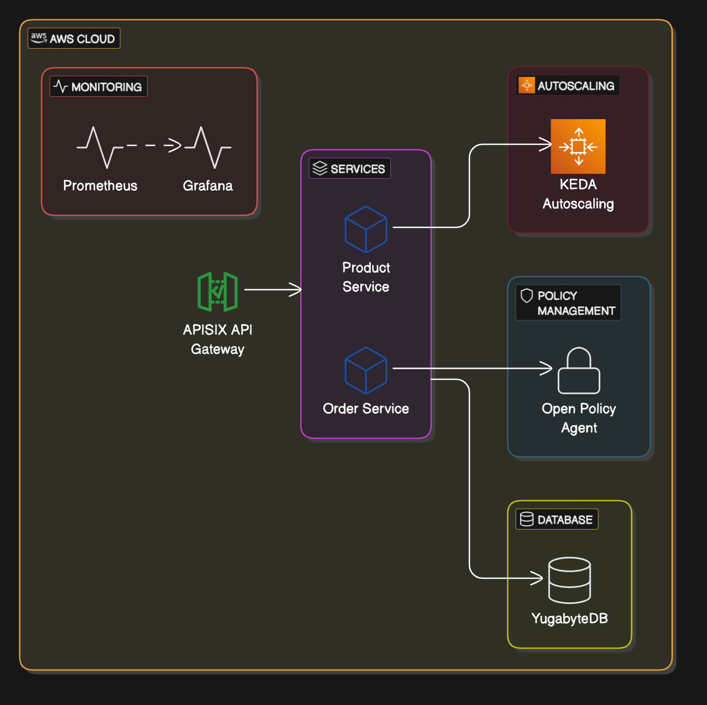

# Kubernetes Microservices Project

## Overview
This project deploys a microservices architecture on Kubernetes featuring two services:
- **Product Service**: Manages product information (e.g., CRUD operations for products).
- **Order Service**: Handles order processing (e.g., creating and retrieving orders).

The services are integrated with:
- **YugabyteDB**: A distributed SQL database for data persistence.
- **APISIX**: An API Gateway for routing external requests.
- **Open Policy Agent (OPA)**: Enforces service-to-service communication policies.
- **KEDA**: Enables event-driven autoscaling based on metrics.

## Architecture
The architecture consists of the following components:
- External clients send requests to the **APISIX API Gateway**.
- APISIX routes requests to the **Product Service** (`/products`) or **Order Service** (`/orders`).
- Services communicate via HTTP, with **OPA sidecars** enforcing policies (e.g., only Order Service can query Product Service for product details).
- Both services persist data in **YugabyteDB**.
- **KEDA** monitors metrics (e.g., CPU, custom Prometheus metrics) and scales the services accordingly.

**Diagram**:


## Prerequisites
- Kubernetes cluster (e.g., AWS EKS, Minikube)
- Helm 3
- `kubectl` configured for your cluster
- Docker
- AWS CLI (if using EKS)
- Git

## Installation
### 1. Clone the Repository
```bash
git clone https://github.com/eniayo/kubernetes-microservices-project.git
cd kubernetes-microservices-project
```

### 2. Deploy YugabyteDB
```bash
helm install yugabyte yugabyte/yugabyte --namespace microservices --create-namespace
```

### 3. Deploy APISIX
```bash
helm install apisix apisix/apisix --namespace microservices
```

### 4. Deploy Microservices
```bash
helm install product-service ./charts/product-service --namespace microservices
helm install order-service ./charts/order-service --namespace microservices
```

### 5. Deploy OPA
```bash
kubectl apply -f manifests/opa-policies.yaml -n microservices
```

### 6. Deploy KEDA
```bash
helm install keda kedacore/keda --namespace microservices
kubectl apply -f manifests/keda-scalers.yaml -n microservices
```

## Configuration
- **YugabyteDB**: Connection strings in `charts/*/values.yaml` (e.g., `postgresql://yugabyte@yugabyte-db:5433`).
- **APISIX**: Routes defined in `manifests/apisix-routes.yaml`.
- **OPA**: Policies in `manifests/opa-policies.yaml` (e.g., allow Order Service to query Product Service).
- **KEDA**: `ScaledObjects` in `manifests/keda-scalers.yaml` with triggers for CPU and Prometheus metrics.

## Usage
### Get the APISIX Gateway IP
```bash
export GATEWAY_IP=$(kubectl get svc apisix-gateway -n microservices -o jsonpath='{.status.loadBalancer.ingress[0].hostname}')
```

### Test Endpoints
```bash
curl -H "Host: api.microservices.local" http://$GATEWAY_IP/products/
curl -H "Host: api.microservices.local" http://$GATEWAY_IP/orders/
```

## Challenges Faced and Solutions
### 1. APISIX Routing
- **Challenge**: Misconfigured routes led to 404 errors.
- **Solution**: Used host-based routing (`api.microservices.local`) and validated with `kubectl describe apisixroute`.

### 2. OPA Policy Enforcement
- **Challenge**: Initial policies blocked all traffic.
- **Solution**: Defined granular Rego policies (e.g., `allow if input.request.path == "/products" and input.src == "order-service"`).

### 3. KEDA Autoscaling
- **Challenge**: Prometheus metrics weren’t triggering scaling.
- **Solution**: Exposed custom metrics endpoints in services and configured KEDA `ScaledObjects` correctly.

### 4. YugabyteDB Persistence
- **Challenge**: Data loss on pod restarts.
- **Solution**: Configured Persistent Volume Claims (PVCs) with appropriate storage classes.

## Testing
### 1. Unit Tests
Run tests in services:
```bash
pytest services/product-service/
pytest services/order-service/
```

### 2. Integration Tests
Verify communication between services:
```bash
curl -H "Host: api.microservices.local" http://$GATEWAY_IP/products/
curl -H "Host: api.microservices.local" http://$GATEWAY_IP/orders/
```

### 3. Load Tests
Apply load with Locust:
```bash
locust -f tests/locustfile.py
```

## Contributing
1. Fork the repository.
2. Create a feature branch:
   ```bash
   git checkout -b feature/new-feature
   ```
3. Submit a pull request.

## License
MIT License - see `LICENSE` file for details.

